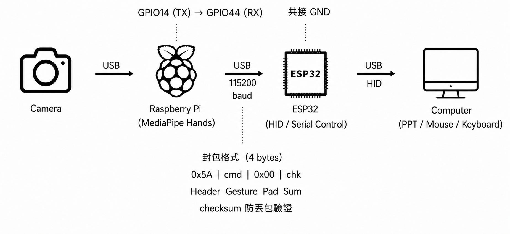
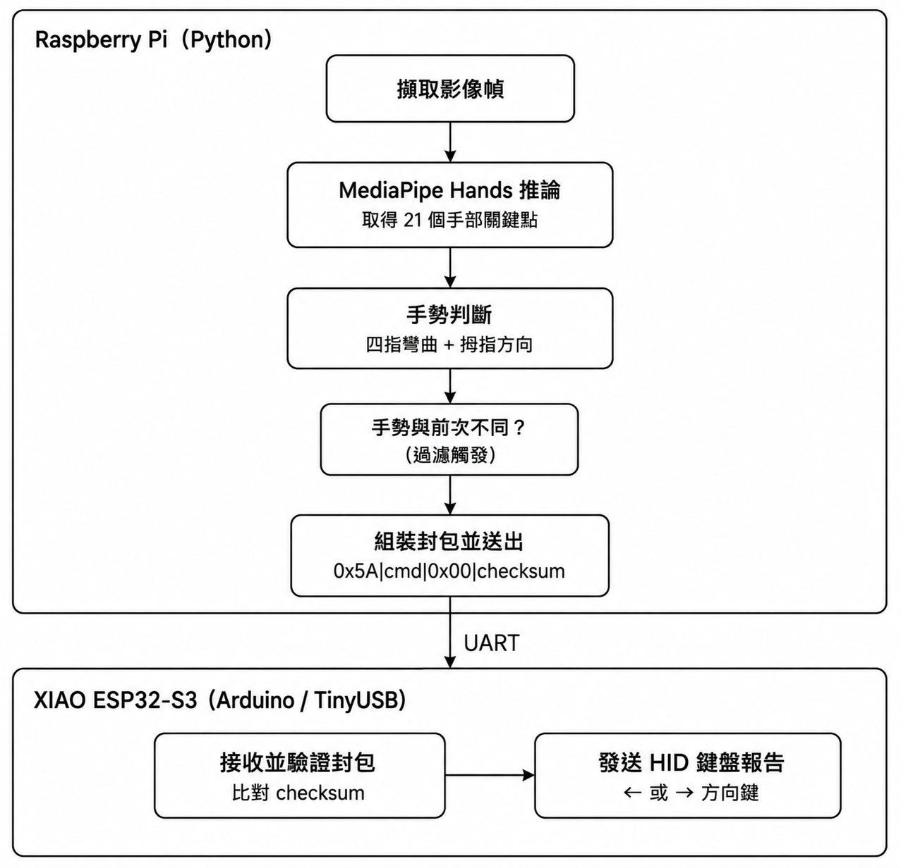

# AI 手勢偵測控制系統

透過即時影像辨識手勢，將辨識結果轉換為標準 USB HID 鍵盤訊號，實現免接觸式簡報控制。

---

## 系統架構


```
USB 鏡頭 (1080P, UVC)
    │  USB
    ▼
Raspberry Pi 4 (MediaPipe Hands)
    │  UART, 115200 baud, 4-byte packet
    ▼
XIAO ESP32-S3 (TinyUSB HID Keyboard)
    │  USB HID
    ▼
Computer (PowerPoint / Keynote / Slides)
```

| 元件 | 角色 | 主要技術 |
|---|---|---|
| USB 鏡頭 | 影像擷取 | UVC 標準，免驅動 |
| Raspberry Pi 4 | 手勢辨識與封包編碼 | Python 3.11 + MediaPipe Hands + OpenCV |
| XIAO ESP32-S3 | 封包解析與 HID 輸出 | Arduino + TinyUSB |
| Computer | 指令接收端 | 標準 HID 鍵盤驅動（系統原生） |

---

## 通訊協議



樹莓派與 XIAO 之間採用自定義 4-byte 封包，搭配 checksum 防止資料毀損：

| Byte | 內容 | 說明 |
|---|---|---|
| 0 | `0x5A` | Header，固定值，用於封包同步 |
| 1 | `cmd` | `0x01` = 下一頁／`0x02` = 上一頁 |
| 2 | `0x00` | Reserved，保留供未來擴充 |
| 3 | `checksum` | `(byte0 + byte1 + byte2) & 0xFF` |

接收端逐位元組讀取，狀態機比對 Header 完成封包同步，並驗證 checksum 後才執行對應動作。

---

## 手勢辨識邏輯

使用 MediaPipe Hands 取得 21 個手部關鍵點座標，透過雙重條件判斷降低誤觸發率：

1. **四指彎曲判定**：食指、中指、無名指、小指的指尖 y 座標皆大於其 PIP 關節 y 座標（Y 軸向下為正）
2. **拇指方向判定**：拇指尖端 y 座標相對於掌心中心點（食指根部與小指根部中點）的相對位置，決定朝上（讚）或朝下（倒讚）

僅當「四指彎曲」且「拇指方向明確」同時成立時，才回報有效手勢，避免一般張掌動作被誤判。

採用邊緣觸發送出：手勢狀態改變且非 0 時才送出封包，避免重複觸發。

---

## 獨立運作模式（controller.py）

樹莓派端提供 `controller.py`，使整套手勢辨識系統可在無需 SSH 連線的情況下獨立運作，並透過 systemd service 實現開機自動啟動。

### 按鈕行為

| 操作 | 行為 |
|---|---|
| **短按**（< 3 秒） | 第一次按下：啟動 `gesture_sim.py`，LED 亮；再按一次：終止辨識，LED 滅 |
| **長按**（≥ 3 秒） | LED 快速閃爍 3 下作為警告，若辨識程式執行中先優雅關閉，接著執行 `sudo shutdown -h now` |

### 設計概念：事件驅動（Event-Driven）

本控制器使用 `gpiozero` 函式庫（底層使用 `lgpio`），透過 `Button.when_pressed`、`Button.when_released`、`Button.when_held` 回呼函式監聽按鈕事件，CPU 在無事件時保持閒置，不進行輪詢（polling）。

> ⚠️ 原始設計使用 `RPi.GPIO.add_event_detect()`，但 Raspberry Pi OS Trixie 的新版核心將 BCM GPIO controller 重新編號為 `gpiochip512`，導致 `RPi.GPIO` 的 edge detection 無法正常向核心註冊（`RuntimeError: Failed to add edge detection`）。改用 `gpiozero` + `lgpio` 可正確對應新編號，問題解決。

```python
button.when_pressed  = on_pressed   # 記錄按下時間戳記
button.when_released = on_released  # 放開時判斷長短按
button.when_held     = on_held      # 按住達 HOLD_TIME 秒時觸發關機
```

| 設計要素 | 說明 |
|---|---|
| **短按判定** | 在 `when_released` 回呼中，以 `time.monotonic()` 計算按壓時間，< 3 秒視為短按 |
| **長按判定** | `Button(hold_time=3)` 設定，按住達 3 秒時 `when_held` 自動觸發 |
| **Debounce** | `Button(bounce_time=0.3)`（秒），過濾機械按鈕物理彈跳 |
| **狀態指示** | LED 點亮表示辨識程式執行中，熄滅表示閒置，閃爍 3 下表示即將關機 |

### 子程序生命週期管理

- **啟動**：`subprocess.Popen()` 建立 `gesture_sim.py` 子程序，獨立於 controller 主程式運作
- **終止**：發送 `SIGINT`（等同 `Ctrl+C`），使 `gesture_sim.py` 進入既有的 `except KeyboardInterrupt` 區塊，正常釋放攝影機與序列埠資源；若 3 秒內未結束則強制 `kill()`

### 開機自動啟動（systemd service）

`controller.py` 透過 systemd service 設定為開機自動啟動，實現「無 SSH、無螢幕」的完全獨立運作。

service 檔案路徑：`/etc/systemd/system/gesture-controller.service`

```ini
[Unit]
Description=AI Gesture Controller (button + LED, standalone mode)
After=multi-user.target

[Service]
Type=simple
User=raccoon
WorkingDirectory=/home/raccoon
ExecStart=/home/raccoon/venv311/bin/python /home/raccoon/controller.py
Restart=on-failure
RestartSec=3

[Install]
WantedBy=multi-user.target
```

> ⚠️ `WorkingDirectory=/home/raccoon` 為必要設定。若省略，`lgpio` 無法在根目錄建立通知檔案，導致 pin factory 初始化失敗並 fallback 回 `RPi.GPIO`，再次觸發 `Failed to add edge detection` 錯誤。

啟用指令：

```bash
sudo systemctl daemon-reload
sudo systemctl enable gesture-controller.service
sudo systemctl start gesture-controller.service
```

### 長按關機的 sudoers 設定

```bash
sudo visudo -f /etc/sudoers.d/raccoon-shutdown
```

加入：

```
raccoon ALL=(ALL) NOPASSWD: /sbin/shutdown
```

---

## 硬體接線

### 樹莓派 ↔ XIAO ESP32-S3

| 樹莓派 | XIAO ESP32-S3 |
|---|---|
| Pin 8 (GPIO14 / TX) | D7 (GPIO44 / RX) |
| Pin 9 (GND) | GND |

### 樹莓派 ↔ 按鈕／LED

| GPIO | 實體 Pin | 功能 | 接法 |
|---|---|---|---|
| GPIO17 | Pin 11 | 短按啟動/終止、長按關機 | GPIO17 → 按鈕 → GND（內部 Pull-up） |
| GPIO27 | Pin 13 | 狀態 LED | GPIO27 → 220Ω 電阻 → LED 長腳 → LED 短腳 → GND |
| GND | Pin 14 | 共用接地 | 按鈕與 LED 的 GND 端可共用此腳位 |

---

## 環境設定

### Raspberry Pi

```bash
# Python 3.11（MediaPipe 相容版本，透過 pyenv 安裝）
python -m venv venv311
source venv311/bin/activate
pip install mediapipe==0.10.8 opencv-python pyserial RPi.GPIO gpiozero lgpio

# 啟用 GPIO UART
sudo raspi-config  # Interface Options → Serial Port
#   - login shell over serial: No
#   - serial port hardware: Yes
```

UART 裝置位於 `/dev/ttyS0`，鮑率 115200。

> ⚠️ `gesture_sim.py` 為**無頭模式（headless）**版本，已移除 `cv2.imshow()`、`cv2.waitKey()` 等需要顯示環境的程式碼，序列埠固定使用 `/dev/ttyS0`，可直接由 `controller.py` 透過 `subprocess.Popen()` 在背景啟動，不需要 SSH 或顯示器。

### XIAO ESP32-S3

使用 Arduino + `arduino-cli`，需指定 USB-OTG 模式以啟用 HID：

```bash
arduino-cli compile --fqbn esp32:esp32:XIAO_ESP32S3 \
    --build-property "build.extra_flags=-DARDUINO_USB_MODE=0 -DARDUINO_USB_CDC_ON_BOOT=0" \
    main
```

> ⚠️ 進入 USB-OTG（HID）模式後，序列埠（用於上傳）將消失。重新上傳須進入 Bootloader 模式：按住 **BOOT** 不放 → 插入 USB → 放開 BOOT。

---

## 執行方式

### 手動執行（除錯用）

```bash
ssh raccoon@rocketraccoon.local
source venv311/bin/activate
python gesture_sim.py
```

### 獨立運作模式（systemd 自動啟動）

開機後 `gesture-controller.service` 自動啟動 `controller.py`，無需 SSH 或任何手動操作：

```bash
# 查看 service 狀態
sudo systemctl status gesture-controller.service

# 即時查看 log（除錯用）
journalctl -u gesture-controller.service -f
```

**操作方式**：

- **短按一次**：啟動辨識，LED 亮；**再短按一次**：終止辨識，LED 滅
- **長按 3 秒**：LED 閃爍 3 下警告 → 安全關機

> 開機後建議等待約 30-60 秒（讓 USB 鏡頭驅動完全初始化後）再按按鈕，避免 `cv2.VideoCapture(0)` 因裝置尚未就緒而失敗。

---

## 系統規格摘要

| 項目 | 數值 |
|---|---|
| 辨識手勢 | 👍 下一頁 / 👎 上一頁 |
| 通訊鮑率 | 115200 bps |
| 封包長度 | 4 bytes（含 checksum） |
| 影像解析度 | 1080P @ 30fps |
| 硬體總成本 | 約 NT$3,615 |

---

# 燒錄程序說明

本系統包含兩個需要燒錄/部署程式碼的端點：
1. Raspberry Pi 4（手勢辨識端，Python）
2. XIAO ESP32-S3（HID 輸出端，Arduino）

---

## 一、Raspberry Pi 4 端環境部署

### 1. 系統環境

- 硬體：Raspberry Pi 4 (4GB)
- 作業系統：Raspberry Pi OS 64-bit (Debian Trixie)
- 主機名稱：`RocketRaccoon`，使用者：`raccoon`
- 連線方式：`ssh raccoon@rocketraccoon.local`

### 2. Python 版本管理（pyenv）

Trixie 預設的 Python 3.13 與 MediaPipe 不相容，需安裝 Python 3.11.9：

```bash
curl https://pyenv.run | bash
# 將 pyenv 加入 shell 設定後 source ~/.bashrc

pyenv install 3.11.9
pyenv local 3.11.9
```

下載來源：[pyenv 官方 GitHub](https://github.com/pyenv/pyenv)

### 3. 建立虛擬環境並安裝套件

```bash
python -m venv venv311
source venv311/bin/activate

pip install mediapipe==0.10.8 opencv-python pyserial RPi.GPIO gpiozero lgpio
```

| 套件 | 版本 | 來源 |
|---|---|---|
| mediapipe | 0.10.8 | PyPI: https://pypi.org/project/mediapipe/0.10.8/ |
| opencv-python | 最新版（依 pip 解析） | PyPI: https://pypi.org/project/opencv-python/ |
| pyserial | 最新版 | PyPI: https://pypi.org/project/pyserial/ |
| RPi.GPIO | 最新版 | PyPI: https://pypi.org/project/RPi.GPIO/（已安裝但不再用於中斷，保留備用） |
| gpiozero | 最新版 | PyPI: https://pypi.org/project/gpiozero/ |
| lgpio | 最新版 | PyPI: https://pypi.org/project/lgpio/（gpiozero 底層 pin factory，相容 Trixie 新版 gpiochip 編號） |

### 4. 啟用 GPIO UART

```bash
sudo raspi-config
```

進入 `Interface Options → Serial Port`：
- "login shell over serial"：選 **No**
- "serial port hardware enabled"：選 **Yes**

設定完成後重開機，UART 裝置路徑為 `/dev/ttyS0`（**非** `/dev/ttyAMA0`）。

### 5. 部署檔案

將 `gesture_sim.py`、`controller.py` 放置於 `/home/raccoon/`，確保 `controller.py` 內的路徑設定一致：

```python
GESTURE_SCRIPT = "/home/raccoon/gesture_sim.py"
PYTHON_BIN     = "/home/raccoon/venv311/bin/python"
```

### 6. 執行方式

```bash
# 手動執行（除錯用）
source venv311/bin/activate
python gesture_sim.py

# 獨立運作模式（按鈕啟動/終止）
python controller.py
```

---

## 二、XIAO ESP32-S3 端燒錄程序

### 1. 開發工具

- 開發方式：Arduino + `arduino-cli` + `Makefile`（不使用 Arduino IDE GUI）
- 開發環境：Mac (Apple Silicon) / Windows，皆可使用 `arduino-cli`

### 2. arduino-cli 安裝

下載與安裝說明：[arduino-cli 官方文件](https://arduino.github.io/arduino-cli/latest/installation/)

```bash
# macOS (Homebrew)
brew install arduino-cli

# Windows：至官方 Releases 下載對應版本執行檔
# https://github.com/arduino/arduino-cli/releases
```

### 3. 安裝 ESP32 開發板套件（Board Package）

需新增 Espressif 的開發板索引 URL：

```
https://raw.githubusercontent.com/espressif/arduino-esp32/gh-pages/package_esp32_index.json
```

安裝指令：

```bash
arduino-cli config init
arduino-cli config add board_manager.additional_urls \
    https://raw.githubusercontent.com/espressif/arduino-esp32/gh-pages/package_esp32_index.json

arduino-cli core update-index
arduino-cli core install esp32:esp32
```

> 開發板套件來源（GitHub）：https://github.com/espressif/arduino-esp32

### 4. 使用的函式庫

- `USB.h`、`USBHIDKeyboard.h`：屬於 `esp32:esp32` 核心內建函式庫，安裝核心後即可直接 `#include`，無需另外下載。

### 5. 編譯參數

XIAO ESP32-S3 需指定 USB-OTG（Native USB / HID）模式：

```bash
arduino-cli compile \
    --fqbn esp32:esp32:XIAO_ESP32S3 \
    --build-property build.extra_flags="-DARDUINO_USB_MODE=0 -DARDUINO_USB_CDC_ON_BOOT=0" \
    main
```

### 6. 上傳（燒錄）

```bash
arduino-cli upload \
    --fqbn esp32:esp32:XIAO_ESP32S3 \
    -p <序列埠路徑> \
    main
```

- macOS：序列埠路徑通常為 `/dev/cu.usbmodem*`
- Windows：序列埠路徑通常為 `COM3`、`COM4` 等

本專案以 `Makefile` 整合上述步驟：

```bash
make flash    # 等同先 compile 再 upload
make monitor  # 開啟序列埠監控，鮑率 115200
```

### 7. 進入 Bootloader 模式（重新燒錄）

由於設定 `ARDUINO_USB_MODE=0`（USB-OTG / HID 模式）後，原本用於上傳的序列埠會消失，**每次重新燒錄前需手動進入 Bootloader 模式**：

1. 按住 **BOOT** 按鈕不放
2. 將 XIAO 的 USB 接上電腦
3. 放開 **BOOT** 按鈕
4. 此時裝置會以 Bootloader 模式被偵測到，可執行 `make flash`

### 8. 目前部署版本說明

- **目前燒錄於 XIAO 上、demo 使用中的版本**：採用 `Serial.begin(115200)`（標準 UART0），對應 `main.ino`（`Serial.begin(115200)` 版本），於 Windows 平台燒錄與測試通過。
- 另有嘗試改用 `Serial1.begin(115200, SERIAL_8N1, 44, 43)`（指定 GPIO44/43 為 RX/TX）之版本，因涉及 ESP32-S3 strapping pin（開機模式選擇腳位）衝突，導致燒錄後裝置無法被電腦偵測，**該版本尚未燒錄成功，暫不使用**。


# 實際操作程式除錯過程紀錄

本文件記錄專案開發過程中實際遇到的除錯案例，包含問題現象、排查步驟與最終處理方式，供後續維護或交接參考。

---

## 案例一：Raspberry Pi 上 MediaPipe 與 Python 版本不相容

### 問題現象

在 Raspberry Pi 4（Raspberry Pi OS 64-bit, Debian Trixie）上以系統預設 Python 環境安裝 `mediapipe` 時，安裝失敗或執行時報錯，無法正常載入 `mp.solutions.hands`。

### 排查步驟

1. 確認系統預設 Python 版本：Trixie 預設為 Python 3.13。
2. 查詢 MediaPipe 官方支援的 Python 版本範圍，確認 0.10.8 版本不支援 Python 3.13。
3. 決定不直接更換系統 Python（避免影響其他系統套件相依性），改用 `pyenv` 安裝獨立的 Python 版本。

### 處理方式

- 透過 `pyenv` 安裝 Python 3.11.9。
- 以 `python -m venv venv311` 建立獨立虛擬環境，於該環境中安裝 `mediapipe==0.10.8`、`opencv-python`、`pyserial`、`RPi.GPIO`。

### 注意事項

- 之後所有執行（手動測試、`controller.py` 啟動子程序）皆須明確指定 `venv311` 中的 Python 路徑（`/home/raccoon/venv311/bin/python`），不可依賴系統預設 `python3`，否則會找不到 `mediapipe`。

---

## 案例二：樹莓派 UART 裝置路徑誤用 `/dev/ttyAMA0`

### 問題現象

在 `raspi-config` 中啟用 GPIO UART 後，依照網路上常見教學以 `/dev/ttyAMA0` 開啟序列埠，`gesture_sim.py` 執行時序列埠開啟失敗或無資料輸出，樹莓派端無法成功送出封包至 XIAO。

### 排查步驟

1. 確認 `raspi-config → Interface Options → Serial Port` 設定：
   - login shell over serial：No
   - serial port hardware：Yes
2. 檢查 `/dev/` 底下實際存在的序列埠裝置節點，發現 Raspberry Pi 4 在此設定下，對應 GPIO14/15 的 UART 實際對應到 `/dev/ttyS0`，而 `/dev/ttyAMA0` 在此硬體/系統組合下並非對應到該腳位。
3. 修改 `gesture_sim.py` 中 `serial.Serial()` 的裝置路徑為 `/dev/ttyS0`，重新測試。

### 處理方式

- 將樹莓派端序列埠固定使用 `/dev/ttyS0`，鮑率 115200，與 XIAO 端 `Serial.begin(115200)` 對應一致。

### 注意事項

- 不同型號 Raspberry Pi 或不同 OS 版本，`/dev/ttyAMA0` 與 `/dev/ttyS0` 對應的 UART 控制器可能不同，部署到其他硬體時須重新確認。

---

## 案例三：XIAO ESP32-S3 改用 `Serial1`（GPIO44/43）後 USB 裝置消失

### 問題現象

原始版本使用 `Serial.begin(115200)`（標準 UART0）接收樹莓派封包並輸出 HID，運作正常。為避免占用預設 UART，改寫為：

```cpp
Serial1.begin(115200, SERIAL_8N1, 44, 43); // RX=44, TX=43
```

燒錄後，Mac 端 `system_profiler` 與 `arduino-cli board list` 皆偵測不到任何裝置，嘗試多種「按住 BOOT + 按 RESET」組合進入 Bootloader 模式皆失敗，無法重新燒錄。

### 排查步驟

1. 確認接線：樹莓派 Pin 8 (GPIO14/TX) → XIAO D7 (GPIO44/RX)，樹莓派 Pin 9 (GND) → XIAO GND，接線本身無誤。
2. 查閱 ESP32-S3 技術文件，發現 **GPIO43 與 GPIO44 為 strapping pins**（晶片開機模式選擇腳位），在開機瞬間這兩腳位的電位會影響晶片進入何種啟動模式。
3. 懷疑：`Serial1.begin(..., 44, 43)` 將這兩腳位設定為 UART RX/TX 後，可能在開機時序上與晶片原本依賴這兩腳位判斷的啟動模式互相干擾，導致 USB 控制器未正確初始化、裝置無法被主機列舉（enumerate）。
4. 嘗試多次以「按住 BOOT → 插入 USB → 放開 BOOT」進入下載模式，但因裝置本身在此狀態下可能未進入預期的 Bootloader 狀態，均未成功。

### 處理方式（目前狀態）

- **實測發現：將 XIAO 透過 USB Hub（而非直接接電腦的 USB Port）連接，裝置即可被 `system_profiler` / `arduino-cli board list` 正常偵測到並進入 Bootloader 模式。** 此方法尚未確認根本原因，但實測有效，可解決「裝置完全無法被偵測」的問題。
- 即使裝置可被偵測，demo 仍採用**舊版 `Serial.begin(115200)`**（標準 UART0，對應 `01_程式碼/XIAO_ESP32S3端/main.ino`）版本，於 Windows 上燒錄並測試通過，可正常接收封包並輸出方向鍵 HID 訊號。
- 新版 `Serial1`（GPIO44/43）程式碼**尚未燒錄成功並完整驗證**，不列入目前 demo 使用版本。

### 注意事項 / 後續排查方向

- **裝置無法被偵測時，可先嘗試改接 USB Hub 再進入 Bootloader 模式**，實測可解決偵測問題；原因尚不確定，推測可能與供電穩定性或時序相關，但未驗證。
- 若未來需重新嘗試 `Serial1` 方案，建議改用**非 strapping pin** 的腳位（例如 D0/D1 = GPIO1/GPIO2），避開開機模式選擇腳位的衝突。
- 進入 Bootloader 模式的時序（BOOT/RESET 按壓順序與時間）在不同板子修訂版本上可能略有差異，建議參考 Seeed 官方 wiki 的對應板型說明。
- 若裝置完全無法被偵測，建議排查順序：① 改接 USB Hub ② 確認 USB 線材/Port ③ 確認驅動程式 ④ 再考慮是否為 strapping pin 衝突所致，避免排查方向錯誤。

---

## 案例四：`RPi.GPIO` 在 Raspberry Pi OS Trixie 上 `Failed to add edge detection`

### 問題現象

`controller.py` 原始版本使用 `RPi.GPIO.add_event_detect()` 監聽按鈕 GPIO 腳位的邊緣觸發事件。在 Raspberry Pi OS Trixie 上執行時，程式在初始化階段即報錯並退出：

```
RuntimeError: Failed to add edge detection
```

不論是否以 `sudo` 執行均出現相同錯誤。

### 排查步驟

1. 確認 `raccoon` 已屬於 `gpio` 群組（`groups raccoon` 確認），排除單純權限問題。
2. 確認 `RPi.GPIO` 版本為 0.7.1（最新版），硬體為 Raspberry Pi 4 Model B Rev 1.5，排除「Pi 5 不相容」情況。
3. 檢查 `/sys/class/gpio/`，發現存在 `gpiochip512` 與 `gpiochip570`，而非舊版核心預期的 `gpiochip0`。
4. 執行 `cat /sys/class/gpio/gpiochip512/label`，確認輸出為 `pinctrl-bcm2711`（Pi 4 主要 GPIO controller），代表新版 Trixie 核心將 BCM GPIO controller 重新編號至 offset 512。
5. 確認 `RPi.GPIO` 0.7.1 寫死預期 BCM GPIO 對應到 `gpiochip0`，在新編號環境下底層 `ioctl` 失敗，導致 edge detection 無法正常向核心註冊。

### 處理方式

改用 `gpiozero` 函式庫（底層使用 `lgpio`），`lgpio` 會自動偵測正確的 `gpiochip` 編號，不依賴固定 offset：

```bash
pip install gpiozero lgpio
```

`controller.py` 重寫為使用 `gpiozero.Button` 與 `gpiozero.LED`，以 `when_pressed`、`when_released`、`when_held` 回呼取代原本的 `add_event_detect()` 中斷機制。

### 注意事項

- `gpiozero` 的 `Button.when_released` 觸發時，`button.held_time` 屬性值為 `None`（僅在 `when_held` 回呼內可靠），不可用於短/長按判斷。應改以 `time.monotonic()` 在 `when_pressed` 記錄時間戳記，於 `when_released` 計算時間差來判斷長短按。
- `gpiozero` 底層 pin factory 優先順序：`lgpio` > `RPi.GPIO`。若 `lgpio` 初始化失敗（見案例五），會自動 fallback 回 `RPi.GPIO` 並再次觸發相同錯誤。

---

## 案例五：systemd service 下 `lgpio` pin factory 初始化失敗、fallback 回 `RPi.GPIO`

### 問題現象

`controller.py` 改用 `gpiozero` 後，在 SSH 終端機手動執行 `python controller.py` 完全正常；但設定 systemd service 開機自動啟動後，service 啟動即失敗（`exit-code 1/FAILURE`），`journalctl` 顯示：

```
xCreatePipe: Can't set permissions (436) for //.lgd-nfy0, No such file or directory
PinFactoryFallback: Falling back from lgpio: [Errno 2] No such file or directory: '.lgd-nfy-3'
...
RuntimeError: Failed to add edge detection
```

### 排查步驟

1. 確認 `User=raccoon`、`gpio` 群組設定正確，排除權限問題。
2. 分析 log：`lgpio` 嘗試在 `//`（根目錄）建立通知檔案 `.lgd-nfy0`，因 `/` 目錄無寫入權限而失敗。
3. 確認原因：systemd service 未設定 `WorkingDirectory` 時，預設 cwd 為 `/`（根目錄）；手動在終端機執行時，cwd 為 `/home/raccoon`（有寫入權限）。
4. `lgpio` 初始化失敗後，`gpiozero` fallback 回 `RPi.GPIO`，再次觸發案例四的 `Failed to add edge detection` 錯誤。

### 處理方式

在 systemd service 檔案的 `[Service]` 區塊中加入 `WorkingDirectory`：

```ini
[Service]
Type=simple
User=raccoon
WorkingDirectory=/home/raccoon
ExecStart=/home/raccoon/venv311/bin/python /home/raccoon/controller.py
Restart=on-failure
RestartSec=3
```

重新載入並重啟 service 後，`lgpio` 可在 `/home/raccoon/` 下正常建立通知檔案，service 啟動成功（`active (running)`）。

### 注意事項

- `WorkingDirectory` 的設定對任何需要在本地建立暫存檔案的 Python 套件都很重要，systemd service 部署時應養成明確指定的習慣。
- 可用以下指令即時確認 service 運作狀態與 log：
  ```bash
  sudo systemctl status gesture-controller.service
  journalctl -u gesture-controller.service -f
  ```
